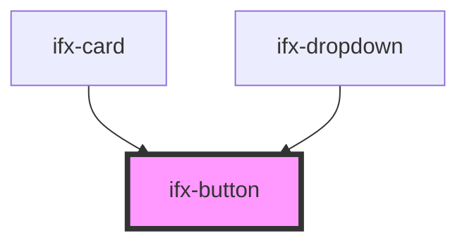

# ifx-button

<!-- Auto Generated Below -->

## Properties

| Property      | Attribute      | Description | Type                                                             | Default     |
| ------------- | -------------- | ----------- | ---------------------------------------------------------------- | ----------- |
| `classString` | `class-string` |             | `string`                                                         | `undefined` |
| `color`       | `color`        |             | `"danger" \| "primary" \| "secondary" \| "success" \| "warning"` | `undefined` |
| `disabled`    | `disabled`     |             | `boolean`                                                        | `undefined` |
| `icon`        | `icon`         |             | `boolean`                                                        | `undefined` |
| `label`       | `label`        |             | `string`                                                         | `undefined` |
| `size`        | `size`         |             | `"m" \| "s"`                                                     | `undefined` |
| `type`        | `type`         |             | `string`                                                         | `undefined` |
| `variant`     | `variant`      |             | `"outline" \| "outline-text" \| "solid"`                         | `undefined` |

## Dependencies

### Used by

 - [ifx-card](../../building-blocks/card)
 - [ifx-dropdown](../../building-blocks/dropdown)

### Graph

----------------------------------------------

*Built with [StencilJS](https://stenciljs.com/)*
