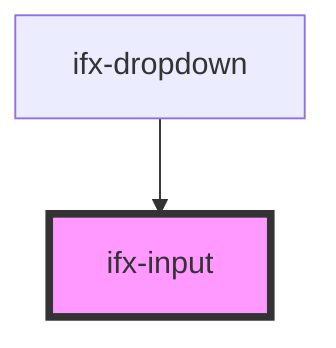

# ifx-input

<!-- Auto Generated Below -->

## Properties

| Property      | Attribute      | Description | Type               | Default     |
| ------------- | -------------- | ----------- | ------------------ | ----------- |
| `classString` | `class-string` |             | `string`           | `undefined` |
| `id`          | `id`           |             | `string`           | `undefined` |
| `placeholder` | `placeholder`  |             | `number \| string` | `undefined` |
| `type`        | `type`         |             | `string`           | `undefined` |
| `value`       | `value`        |             | `number \| string` | `undefined` |

## Dependencies

### Used by

 - [ifx-dropdown](../../building-blocks/dropdown)

### Graph

----------------------------------------------

*Built with [StencilJS](https://stenciljs.com/)*
