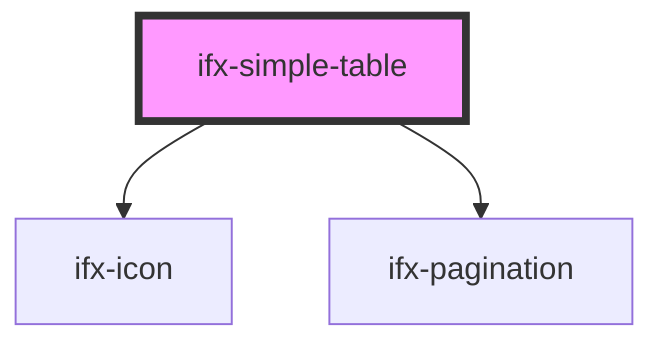

# ifx-icon

<!-- Auto Generated Below -->

## Properties

| Property   | Attribute   | Description | Type           | Default     |
| ---------- | ----------- | ----------- | -------------- | ----------- |
| `columns`  | --          |             | `ColumnType[]` | `undefined` |
| `content`  | --          |             | `any[]`        | `undefined` |
| `pageSize` | `page-size` |             | `number`       | `10`        |

## Dependencies

### Depends on

- [ifx-icon](../../icon)
- [ifx-pagination](.)

### Graph

----------------------------------------------

*Built with [StencilJS](https://stenciljs.com/)*
